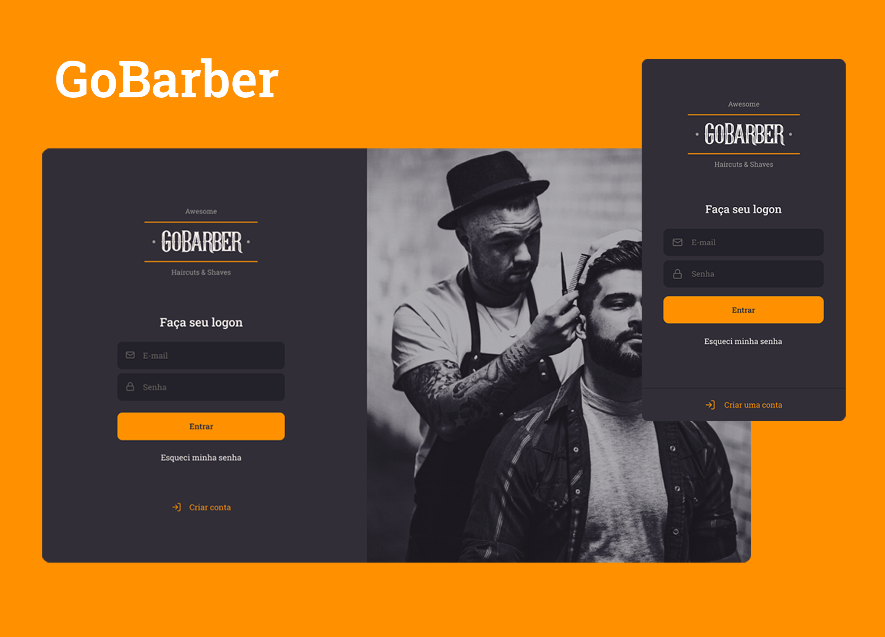

  

    
  

  <h4 align="center">Awesome haircuts and shaves.</h4>

## Resumo

  <ol>
    <li><a href="#visão-geral-do-projeto">Visão geral do projeto</a></li>
    <li><a href="#sobre-o-projeto">Sobre o projeto</a></li>
    <li><a href="#tecnologias-utilizadas">Tecnologias utilizadas</a></li>
    <li><a href="#instalação-e-utilização">Instalação e utilização</a></li>
  </ol>

## Visão geral do projeto

    

## Sobre o projeto

Uma aplicação para agendamento de serviços em uma barbearia. O cliente cria seu
agendamento através do app mobile, ao realizar essa operação, o barbeiro recebe
uma notificação em sua aplicação web.

## Tecnologias utilizadas

As principais tecnologias utilizadas na construção deste projeto foram: 

* [Node](https://nodejs.org/en/)
* [React JS](https://reactjs.org/)
* [React Native CLI](https://reactnative.dev/)

## Instalação e utilização

Instruções de instalação do projeto em seu computador.

### Pré-requisitos 

Instalações necessárias antes de executar o projeto.

1. Node
2. Yarn
3. Git
4. React Native CLI
  
### Instalação

1. Clone o projeto em seu computador

2. Configurar banco de dados.

3. Baixar dependências.

4. Configurar arquivos de variáveis ambiente / banco de dados.

5. Rodar os projetos

 
 
<h4 align="center"><a href="#top">Voltar ao Início</a></h4>

"Estabilidade não existe" - Flavio Augusto
